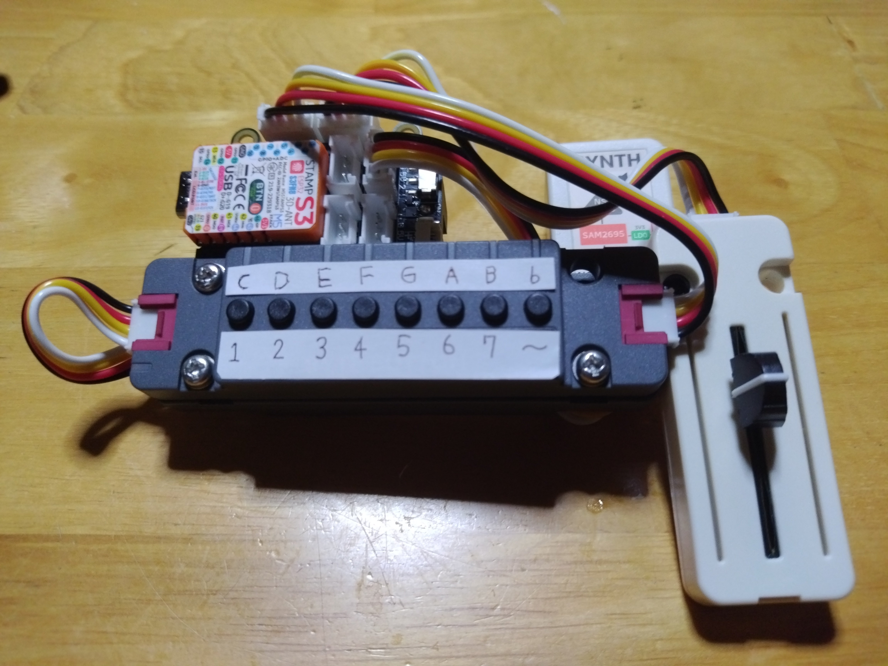
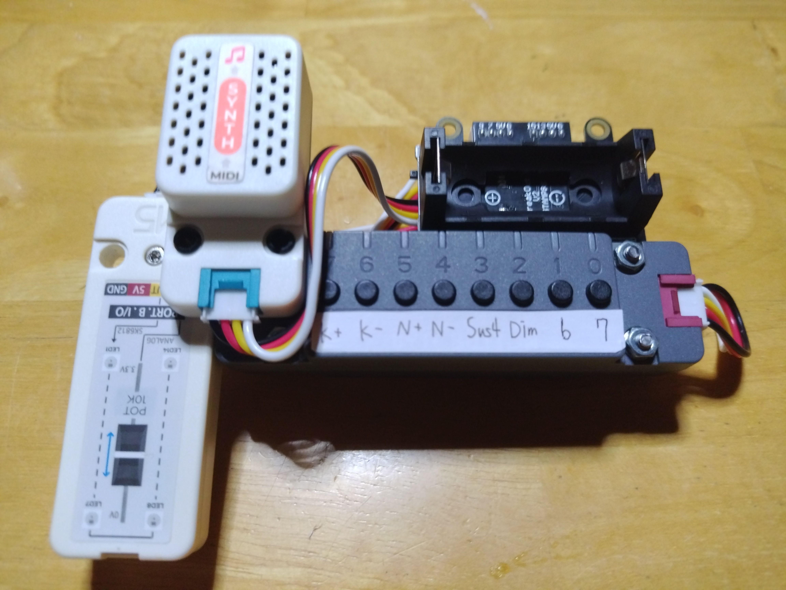
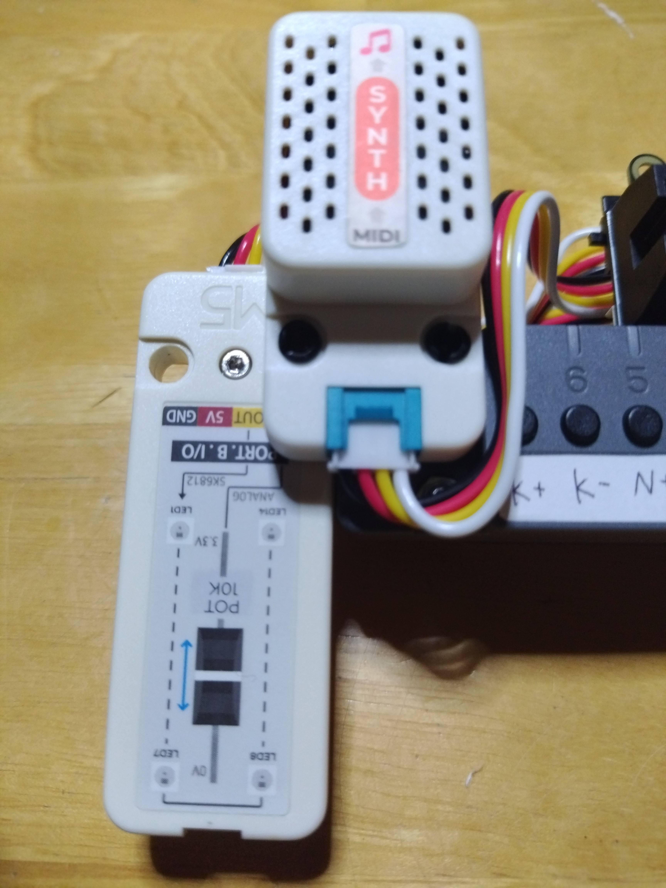
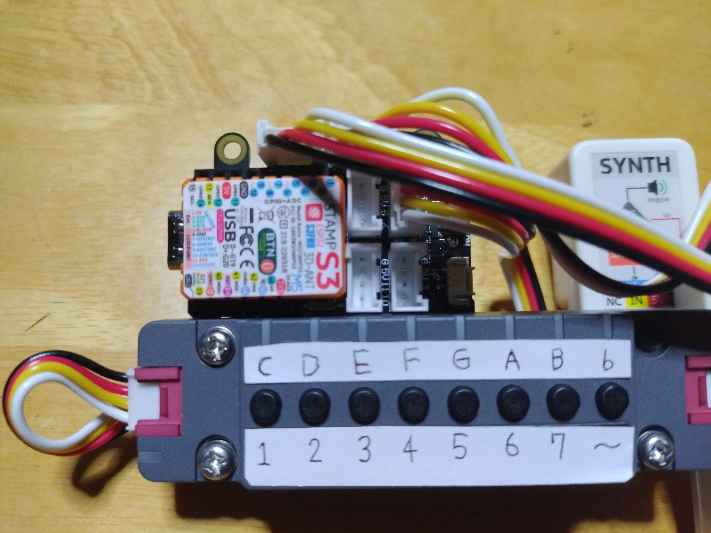
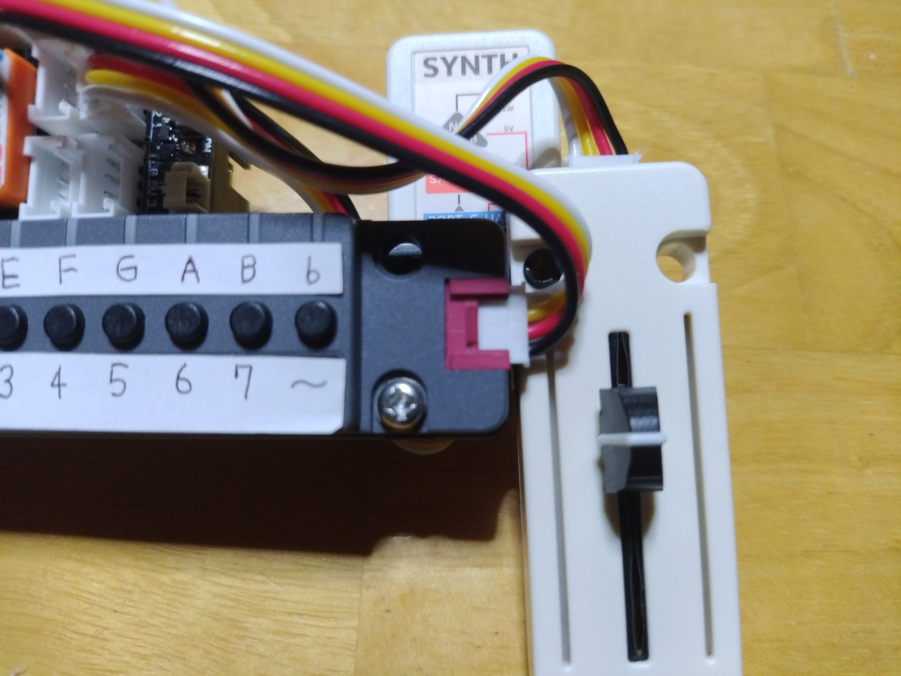

# DualByteStamPlay  
Unofficial fan-made project inspired by "KANTAN Play"

## Important Notice

This project is inspired by KANTAN Play/InstaChord.
It is not an official project of InstaChord Inc. or kantan-music.

## Overview
This is a digital musical instrument project using M5StampS3. By combining two M5Unit-ByteButtons and a MIDI sound board, it creates an intuitive music performance system.
All parts are from M5Stack and can be assembled without soldering.

## Product Images

<div align="center">
  
  
</div>

## Usage

### How to Play

This device follows the chord theory of KANTAN-MUSIC.

- **Front buttons 1-7** play each chord (I-VII).
  Major/minor switching is done with the swap (~) button.

- **Back buttons** allow chord modification (from left: 7th, ♭, dim, sus4).
  N+/N- buttons change the instrument, K-/K+ buttons change the key.

- **Front LEDs** show the current key, and the rightmost ♭ LED indicates a flat key.
  **Back LEDs** light up according to instrument selection (1-6), modifier buttons (7th, ♭, dim), and ♭ button operation.

- **Right slider** adjusts the arpeggio stroke. At the bottom, all 6 notes play simultaneously; sliding up plays notes sequentially.

### Basic Operations
1. **Key Setting**: Change key (C, Db, D...) with ByteButton2 buttons 6/7
2. **Instrument Selection**: Change instrument with ByteButton2 buttons 4/5
3. **Chord Play**: Play degree chords with ByteButton1 buttons 1-7
4. **Modifier**: Hold ByteButton1 button 0 for minor

### Instrument List
1. **SteelGtr** - Steel String Guitar (GM#26)
2. **JazzGtr** - Jazz Guitar (GM#27)
3. **Piano** - Acoustic Piano (GM#1)
4. **EPiano1** - Electric Piano (GM#5)
5. **ChurchOrg** - Church Organ (GM#20) - 4 tones
6. **Strings** - Strings Ensemble (GM#49) - 4 tones

### Arpeggio Settings
- **Stroke Time**: Adjustable 5-125ms via G9 analog value
- **4-tone Mode**: Organ/Strings skip 2nd and 3rd notes

## Hardware Configuration

### Components and Roles

| Component | Role/Usage | Connection/Notes | Documentation |
|---|---|---|---|
| **M5StampS3** | Main controller. Executes all control and performance logic. | Connects to all units, LEDs, MIDI sound board | [Official](https://docs.m5stack.com/en/core/stampS3) |
| **M5Unit-ByteButton ×2** | 8 buttons ×2 (16 total). Chord/modifier/instrument/key control. | I2C (SDA:GPIO13, SCL:GPIO15)<br>Front:0x53, Back:0x4F | [Official](https://docs.m5stack.com/en/unit/byte_button) |
| **Unit Synth (SAM2695)** | MIDI sound source. Outputs sound via MIDI signals. | Grove (TX:GPIO2, RX:GPIO1)<br>Standard MIDI baud rate:31250bps | [Official](https://docs.m5stack.com/en/unit/Unit-Synth) |
| **Unit Fader** | Analog slider. Adjusts stroke time. Includes SK6812 LED. | G9:Analog input<br>LED is independently controlled | [Official](https://docs.m5stack.com/en/unit/fader) |
| **StampS3 Grove BreakOut** | Grove expansion/power supply. Connects all units. | Direct to StampS3 | [Official](https://docs.m5stack.com/en/accessory/StampS3%20GroveBreakOut) |

#### How to Use Each Unit
- **ByteButton (Front)**: Chord play (I, II, III...) and minor (hold)
- **ByteButton (Back)**: Instrument/key change, extended modifiers
- **Unit Fader**: Adjust stroke time (arpeggio speed)
- **Unit Synth**: Outputs sound via MIDI. Connect speaker/headphones
- **LEDs**: Show performance state and startup test

<div align="center">
  
  <br>Unit Synth and Unit Fader (Back)
  <br><br>
  
  <br>ByteButton1 (Front) and M5StampS3 (on StampS3 Grove BreakOut)
  <br><br>
  
  <br>Unit Fader (Front)
</div>

#### Official Documentation
- [M5StampS3](https://docs.m5stack.com/en/core/stampS3)
- [M5Unit-ByteButton](https://docs.m5stack.com/en/unit/byte_button)
- [Unit Synth (SAM2695)](https://docs.m5stack.com/en/unit/Unit-Synth)
- [Unit Fader](https://docs.m5stack.com/en/unit/fader)
- [StampS3 Grove BreakOut](https://docs.m5stack.com/en/accessory/StampS3%20GroveBreakOut)

## Libraries Used

```ini
fastled/FastLED@^3.9.10                           # LED control
https://github.com/m5stack/M5Unit-ByteButton.git  # Button input
kantan-music                                       # Music theory API (local)
```

## Setup

### 1. Environment Preparation
```bash
# Open as PlatformIO project
pio project init --board m5stack-stamps3
```

### 2. Library Installation
```bash
pio lib install fastled/FastLED@^3.9.10
pio lib install https://github.com/m5stack/M5Unit-ByteButton.git
```

### 3. Build & Upload
```bash
pio run --target upload --environment m5stack-stamps3
```

### 4. Operation Check
```bash
pio device monitor --environment m5stack-stamps3
```

## Technical Specifications

### FreeRTOS Usage
- **Main Task**: Button handling, MIDI control
- **Arpeggio Task**: Asynchronous note sending (priority 1)
- **Timers**: Automatic Note Off (6 independent timers)

### Debounce Details
- **Detection Interval**: 20ms
- **State Management**: Raw → Stable → Event
- **Memory Efficiency**: Bit operations for 8 buttons ×2 devices

### MIDI Optimization
- **Latency Reduction**: Immediate send via Serial1.flush()
- **Duplication Prevention**: Cancel function via generation ID management
- **Volume Control**: Master/channel volume set at startup

## Development Environment

- **Platform**: ESP32 (espressif32)
- **Framework**: Arduino
- **Build System**: PlatformIO

## License

This project includes KANTAN Music API. See `kantan-music/LICENSE_KANTAN_MUSIC.md` for details.

KANTAN Music API original project: [InstaChord/KANTAN_Play_core](https://github.com/InstaChord/KANTAN_Play_core)

Other parts are under the MIT License.

[MIT License (LICENSE file)](./LICENSE)

## Related Product Documentation

- [M5StampS3 Documentation](https://docs.m5stack.com/en/core/stampS3)
- [M5Unit-ByteButton Documentation](https://docs.m5stack.com/en/unit/byte_button)
- [Unit Synth (SAM2695 MIDI sound source) Documentation](https://docs.m5stack.com/en/unit/Unit-Synth)
- [Unit Fader (Analog Slider) Documentation](https://docs.m5stack.com/en/unit/fader)
- [StampS3 Grove BreakOut Documentation](https://docs.m5stack.com/en/accessory/StampS3%20GroveBreakOut)

---
*Note: The English documentation above was translated with assistance from AI (GitHub Copilot).*

---

# DualByteStamPlay (日本語)
unofficial fan-made project inspired by "KANTAN Play"

## 重要事項

本プロジェクトはKANTAN Play/InstaChordにインスパイアされたプロジェクトです。
InstaChord株式会社、およびkantan-music公式プロジェクトではありませんyteStamPlay  
unofficial fan-made project inspired by “KANTAN Play”

## 重要事項

本プロジェクトはKANTAN Play/InstaChordにインスパイアされたプロジェクトです。
InstaChord株式会社、およびkantan-music公式プロジェクトではありません


## 概要
M5StampS3を使用したデジタル楽器プロジェクトです。2つのM5Unit-ByteButtonとMIDI音源ボードを組み合わせて、直感的な音楽演奏システムを構築しています。
M5社の各種パーツを使用しており、はんだ付け不要でくみ上げることが可能です。

## 完成品イメージ

<div align="center">
  
  
</div>

## 使用方法

### 演奏方法

本機はKANTAN-MUSICのコード理論に準拠しています。

- **表面のボタン1～7**で各コード（I～VII）を演奏できます。
  メジャー/マイナーの切り替えはスワップ（～）ボタンで行います。

- **裏面のボタン**でコード修飾（左から順に7th、♭、dim、sus4）が可能です。
  N＋/N-ボタンで音色変更、K-/K+ボタンでキー変更ができます。

- **表面のLED**は現在のキーを表示し、右端の♭LEDはそのキーが♭であることを示します。
  **裏面のLED**は音色1～6、修飾ボタン（7th、♭、dim）、♭ボタンの操作に応じて点灯します。

- **右端のスライダー**は演奏の抑揚を調整します。
  最下部で6音を同時に、上にスライドすると6音が順次演奏されます。

### 基本操作
1. **キー設定**: ByteButton2のボタン6/7でキー変更（C, Db, D...）
2. **音色選択**: ByteButton2のボタン4/5で音色変更
3. **コード演奏**: ByteButton1のボタン1-7でディグリー演奏
4. **モディファイア**: ByteButton1のボタン0（長押し）でマイナー化

### 音色リスト
1. **SteelGtr** - スチールストリングギター（GM#26）
2. **JazzGtr** - ジャズギター（GM#27）
3. **Piano** - アコースティックピアノ（GM#1）
4. **EPiano1** - エレクトリックピアノ（GM#5）
5. **ChurchOrg** - チャーチオルガン（GM#20）- 4音色
6. **Strings** - ストリングスアンサンブル（GM#49）- 4音色

### アルペジオ設定
- **ストローク時間**: G9のアナログ値で5-125ms調整
- **4音色モード**: オルガン・ストリングスでは2,3音をスキップ

## ハードウェア構成


### 構成一覧と役割

| コンポーネント | 役割・使い方 | 接続・備考 | ドキュメント |
|---|---|---|---|
| **M5StampS3** | メインコントローラー。全ての制御・演奏ロジックを実行。 | 各ユニット・LED・MIDI音源と接続 | [公式](https://docs.m5stack.com/en/core/stampS3) |
| **M5Unit-ByteButton ×2** | 8ボタン×2で計16ボタン。コード/モディファイア/音色/キー操作。 | I2C接続（SDA:GPIO13, SCL:GPIO15）<br>表面:0x53, 裏面:0x4F | [公式](https://docs.m5stack.com/en/unit/byte_button) |
| **Unit Synth (SAM2695)** | MIDI音源。MIDI信号を受けて音声出力。 | Grove端子（TX:GPIO2, RX:GPIO1）<br>標準MIDIボーレート:31250bps | [公式](https://docs.m5stack.com/en/unit/Unit-Synth) |
| **Unit Fader** | アナログスライダー。ストロークタイム調整用。SK6812 LED搭載。 | G9:アナログ入力<br>LEDは独立制御 | [公式](https://docs.m5stack.com/en/unit/fader) |
| **StampS3 Grove BreakOut** | Grove端子拡張・電源供給。各ユニットの接続基板。 | StampS3に直結 | [公式](https://docs.m5stack.com/en/accessory/StampS3%20GroveBreakOut) |


#### 各ユニットの使い方
- **ByteButton（表面）**: コード演奏（I, II, III...）やマイナー化（長押し）
- **ByteButton（裏面）**: 音色/キー変更、拡張モディファイア
- **Unit Fader**: ストロークタイム（アルペジオ速度）調整
- **Unit Synth**: MIDI受信で音声出力。スピーカー/ヘッドフォン接続可
- **LED**: 演奏状態や起動時テスト表示

<div align="center">
  
  <br>Unit SynthとUnit Fader（背面）
  <br><br>
  
  <br>ByteButton1（表面）とM5StampS3(StampS3 Grove BreakOutに装着)
  <br><br>
  
  <br>Unit Fader（表面）
</div>

#### 公式ドキュメント
- [M5StampS3](https://docs.m5stack.com/en/core/stampS3)
- [M5Unit-ByteButton](https://docs.m5stack.com/en/unit/byte_button)
- [Unit Synth (SAM2695)](https://docs.m5stack.com/en/unit/Unit-Synth)
- [Unit Fader](https://docs.m5stack.com/en/unit/fader)
- [StampS3 Grove BreakOut](https://docs.m5stack.com/en/accessory/StampS3%20GroveBreakOut)

## 使用ライブラリ

```ini
fastled/FastLED@^3.9.10                           # LED制御
https://github.com/m5stack/M5Unit-ByteButton.git  # ボタン入力
kantan-music                                       # 音楽理論API（ローカル）
```

## セットアップ

### 1. 環境準備
```bash
# PlatformIOプロジェクトとして開く
pio project init --board m5stack-stamps3
```

### 2. ライブラリインストール
```bash
pio lib install fastled/FastLED@^3.9.10
pio lib install https://github.com/m5stack/M5Unit-ByteButton.git
```

### 3. ビルド＆アップロード
```bash
pio run --target upload --environment m5stack-stamps3
```

### 4. 動作確認
```bash
pio device monitor --environment m5stack-stamps3
```

## 技術仕様

### FreeRTOS活用
- **メインタスク**: ボタン処理、MIDI制御
- **アルペジオタスク**: 非同期音符送出（優先度1）
- **タイマー**: Note Off自動送信（6本の独立タイマー）

### デバウンス詳細
- **検出間隔**: 20ms
- **状態管理**: 生状態→安定状態→イベント生成
- **メモリ効率**: ビット演算による8ボタン×2デバイス管理

### MIDI最適化
- **レイテンシ削減**: Serial1.flush()による即座送信
- **重複防止**: 世代ID管理によるキャンセル機能
- **音量制御**: 起動時マスターボリューム・チャンネルボリューム設定

## 開発環境

- **Platform**: ESP32 (espressif32)
- **Framework**: Arduino
- **Build System**: PlatformIO


## ライセンス

このプロジェクトにはKANTAN Music APIが含まれています。詳細は`kantan-music/LICENSE_KANTAN_MUSIC.md`を参照してください。

KANTAN Music APIの元プロジェクト: [InstaChord/KANTAN_Play_core](https://github.com/InstaChord/KANTAN_Play_core)

上記以外のライセンスはMITライセンス準拠です。

[MIT License (LICENSEファイル)](./LICENSE)


## 関連製品ドキュメント

- [M5StampS3 ドキュメント](https://docs.m5stack.com/en/core/stampS3)
- [M5Unit-ByteButton ドキュメント](https://docs.m5stack.com/en/unit/byte_button)
- [Unit Synth (SAM2695 MIDI音源) ドキュメント](https://docs.m5stack.com/en/unit/Unit-Synth)
- [Unit Fader (アナログスライダー) ドキュメント](https://docs.m5stack.com/en/unit/fader)
- [StampS3 Grove BreakOut ドキュメント](https://docs.m5stack.com/en/accessory/StampS3%20GroveBreakOut)
